# Python 터미널 퀴즈 게임

## 1. 프로젝트 소개

이 프로젝트는 Python 표준 라이브러리만 사용하여 만든 터미널 기반 퀴즈 게임이다.

사용자는 터미널 메뉴에서 퀴즈를 추가, 조회, 삭제하고 등록된 퀴즈 중 원하는 개수만큼 랜덤으로 풀 수 있다.

게임 데이터는 `state.json` 파일에 저장되며 프로그램을 다시 실행해도 다음 데이터를 복원할 수 있도록 구현했다.

- 퀴즈 목록
- 전체 게임 점수 기록
- 최고 점수
- 최고 점수를 달성한 게임 기록

GitHub Repository:

[https://github.com/yhana972/Codyssey_E1-2](https://github.com/yhana972/Codyssey_E1-2)

---

## 2. 퀴즈 주제 선정 이유

이 프로젝트의 퀴즈 주제는 **ADsP 문제 은행**이다.

ADsP 자격증 시험을 준비하면서 자주 등장하는 개념을 반복해서 풀어볼 수 있도록 퀴즈 형태로 구성했다.

기본 퀴즈는 다음과 같은 ADsP 학습 범위와 관련된 문제로 구성되어 있다.

- 빅데이터 분석 방법론
- 분석 성숙도
- 위험 대응 방법
- 데이터 거버넌스
- 시계열 분석
- 이상값

사용자가 직접 문제와 힌트를 추가하고 저장할 수 있기 때문에 개인 문제 은행처럼 확장하여 사용할 수 있다.

---

## 3. 프로젝트 목표

이 프로젝트는 Codyssey 과제 제출용으로 Python의 기본 문법과 객체 지향 구조를 사용하여 작은 콘솔 프로그램을 완성하는 것을 목표로 한다.

- 클래스와 객체 사용
- 함수와 메서드 분리
- 리스트와 딕셔너리 활용
- 조건문과 반복문 활용
- 사용자 입력 검증
- 예외 처리
- JSON 파일 입출력
- 데이터 영속성 구현
- 역할별 클래스 분리
- Git 브랜치와 병합 실습
- 안전한 파일 저장
- 최고 점수 및 게임 기록 관리

---

## 4. 실행 환경

프로젝트 검증 환경은 다음과 같다.

- WSL Ubuntu
- Python 3.14.4
- Git
- Python 표준 라이브러리만 사용

외부 패키지를 설치할 필요가 없다.

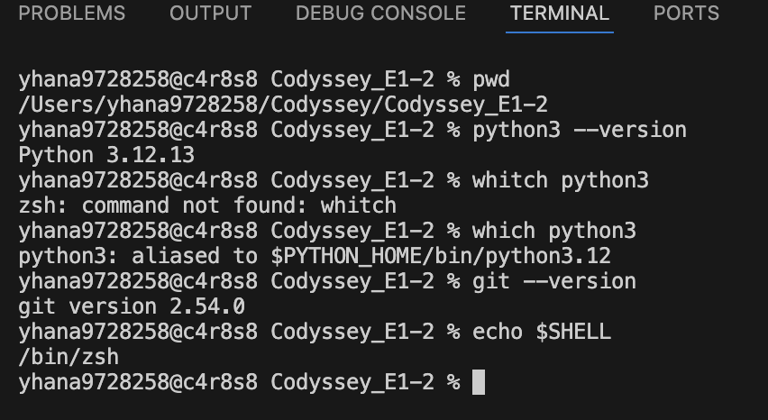

---

## 5. 프로젝트 구조

```text
.
├── main.py
├── quiz.py
├── quiz_game.py
├── console_ui.py
├── data_manager.py
├── state.json
├── docs/
│   └── images/
│       ├── environment.png
│       ├── project-structure.png
│       ├── main-menu.png
│       ├── input-validation.png
│       ├── quiz-add.png
│       ├── quiz-list.png
│       ├── quiz-delete.png
│       ├── question-count-random.png
│       ├── hint.png
│       ├── final-score.png
│       ├── score-history.png
│       ├── best_score.png
│       ├── state-json.png
│       ├── data-restore.png
│       ├── safe-exit.png
│       ├── py-compile.png
│       ├── first-commit.png
│       ├── first-push.png
│       ├── git-pull.png
│       └── git-log.png
├── src/
│   └── .gitkeep
├── .gitignore
└── README.md
```

실제 Python 소스 코드는 프로젝트 루트에 있으며 `docs/images/`에는 구현 결과 및 Git 실습 증빙 화면을 저장했다.

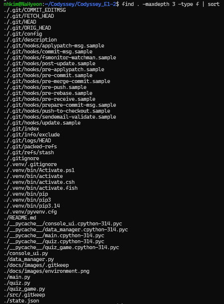

---

## 6. 클래스 구조와 역할

| 파일 | 클래스/함수 | 역할 |
| --- | --- | --- |
| `quiz.py` | `Quiz` | 퀴즈 한 문제의 데이터와 정답 판정 |
| `quiz_game.py` | `QuizGame` | 게임 진행, 퀴즈 관리, 점수 및 최고 기록 관리 |
| `console_ui.py` | `ConsoleUI` | 사용자 입력 검증 및 터미널 출력 |
| `data_manager.py` | `DataManager` | JSON 데이터 저장, 복원 및 복구 |
| `main.py` | `main()` | 객체 생성, 실행, 예외 처리, 종료 시 저장 |

### Quiz

`Quiz` 클래스는 하나의 퀴즈 데이터를 표현한다.

주요 속성:

- `question`: 문제 내용
- `choices`: 선택지 목록
- `answer`: 정답 번호
- `hint`: 힌트

주요 메서드:

| 메서드 | 입력 | 반환 | 역할 |
| --- | --- | --- | --- |
| `is_correct()` | 사용자 답 번호 `int` | `bool` | 사용자 답과 정답 비교 |
| `to_dict()` | 없음 | `dict` | Quiz 객체를 JSON 저장 가능한 딕셔너리로 변환 |
| `from_dict()` | 퀴즈 데이터 `dict` | `Quiz` | JSON 데이터를 Quiz 객체로 복원 |

예를 들어 게임 로직은 직접 정답 값을 비교하지 않고 다음 메서드를 사용한다.

```python
if quiz.is_correct(user_answer):
    ...
```

이를 통해 정답 판정 책임을 `Quiz` 클래스 내부에 둘 수 있다.

또한 JSON 데이터를 객체로 변환할 때도 다음과 같이 사용할 수 있다.

```python
quizzes = [
    Quiz.from_dict(quiz_data)
    for quiz_data in data["quizzes"]
]
```

객체 생성 로직을 여러 파일에서 반복하지 않아도 되기 때문에 유지보수가 쉬워진다.

---

### QuizGame

`QuizGame` 클래스는 게임의 전체 흐름을 담당한다.

주요 메서드:

| 메서드 | 역할 |
| --- | --- |
| `run()` | 메인 메뉴 반복 및 기능 분기 |
| `add_quiz()` | 새로운 퀴즈 추가 |
| `show_quizzes()` | 전체 퀴즈 출력 |
| `delete_quiz()` | 선택한 퀴즈 삭제 |
| `play_quiz()` | 랜덤 퀴즈 실행 및 점수 계산 |
| `show_score_history()` | 최고 기록 및 전체 게임 기록 출력 |

`QuizGame`은 다음 상태를 관리한다.

```text
quizzes
score_history
best_score
best_game
```

---

### ConsoleUI

`ConsoleUI`는 터미널 입출력을 담당한다.

주요 입력 메서드:

| 메서드 | 입력 | 반환 |
| --- | --- | --- |
| `get_number()` | 메시지, 최소값, 최대값 | 범위 내 `int` |
| `get_text()` | 입력 메시지 | 빈 값이 아닌 `str` |
| `get_yes_no()` | 입력 메시지 | `True` 또는 `False` |

주요 출력 메서드:

| 메서드 | 역할 |
| --- | --- |
| `show_message()` | 일반 메시지 출력 |
| `show_main_menu()` | 메인 메뉴 출력 |
| `show_quiz()` | 문제와 선택지 출력 |
| `show_score_record()` | 한 게임의 점수 기록 출력 |
| `show_best_record()` | 최고 점수를 달성한 게임 출력 |

입력 검증과 게임 로직을 분리함으로써 `QuizGame`은 입력 형식보다 게임 진행 자체에 집중하도록 구성했다.

---

### DataManager

`DataManager`는 `state.json` 파일의 저장과 복원을 담당한다.

주요 메서드:

| 메서드 | 반환/역할 |
| --- | --- |
| `load()` | 퀴즈, 전체 기록, 최고 점수, 최고 게임 기록 반환 |
| `save()` | 현재 게임 상태를 JSON으로 저장 |
| `get_default_data()` | 저장 데이터가 없거나 손상되었을 때 기본 데이터 반환 |

`load()` 반환 구조:

```text
quizzes
score_history
best_score
best_game
```

`DataManager`가 파일 처리 책임을 담당하기 때문에 `QuizGame` 내부에서는 직접 JSON 파일을 읽거나 쓰지 않는다.

---

### main

`main.py`는 프로그램의 진입점이다.

주요 역할:

- `DataManager` 생성
- 기존 데이터 불러오기
- `ConsoleUI` 생성
- `QuizGame` 생성
- 게임 실행
- `Ctrl+C`, `Ctrl+D` 안전 종료 처리
- `Ctrl+Z` 정지 방지
- 종료 시 게임 상태 저장

데이터 흐름은 다음과 같다.

```text
state.json
    ↓
DataManager.load()
    ↓
QuizGame
    ↓
게임 진행 및 데이터 변경
    ↓
main.py finally
    ↓
DataManager.save()
    ↓
state.json
```

---

## 7. 주요 기능

현재 구현된 기능은 다음과 같다.

- [x] 메인 메뉴
- [x] 퀴즈 추가
- [x] 퀴즈 목록 조회
- [x] 퀴즈 삭제
- [x] 퀴즈 풀이
- [x] 정답 판정
- [x] 오답 시 실제 정답 표시
- [x] 풀이할 문제 수 선택
- [x] `random.sample()` 기반 랜덤 출제
- [x] 힌트 기능
- [x] 힌트 사용 시 점수 감점
- [x] 100점 만점 점수 계산
- [x] 전체 게임 기록 저장
- [x] 플레이 날짜/시간 저장
- [x] 최고 점수 저장
- [x] 최고 점수를 달성한 게임 기록 저장
- [x] 이전 형식의 JSON에서 최고 점수 복구
- [x] JSON 데이터 영속성
- [x] 손상된 JSON 복구
- [x] `Ctrl+C`, `Ctrl+D` 안전 종료
- [x] `Ctrl+Z` 정지 신호 무시
- [x] 임시 파일을 이용한 안전 저장

---

## 8. 게임 진행 방식

프로그램을 실행하면 다음 메뉴가 반복해서 출력된다.

```text
=== 메인 메뉴 ===
1. 퀴즈 추가
2. 퀴즈 목록
3. 퀴즈 삭제
4. 퀴즈 풀기
5. 점수 기록
0. 종료
================
```

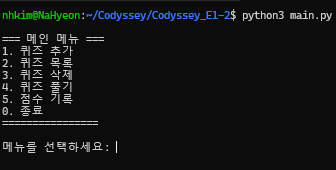

### 퀴즈 추가

사용자가 문제, 선택지 4개, 정답 번호, 힌트를 직접 입력할 수 있다.

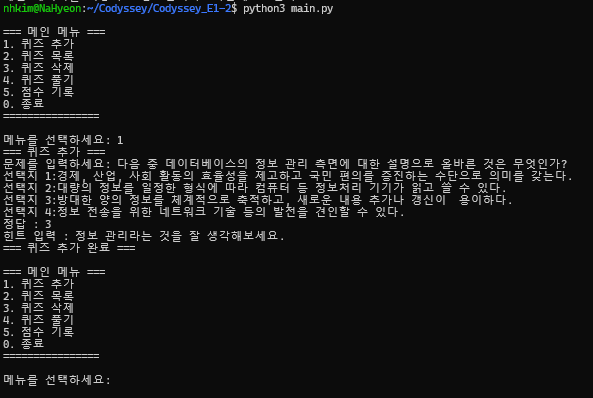

### 퀴즈 목록

등록되어 있는 문제와 선택지를 확인할 수 있다.

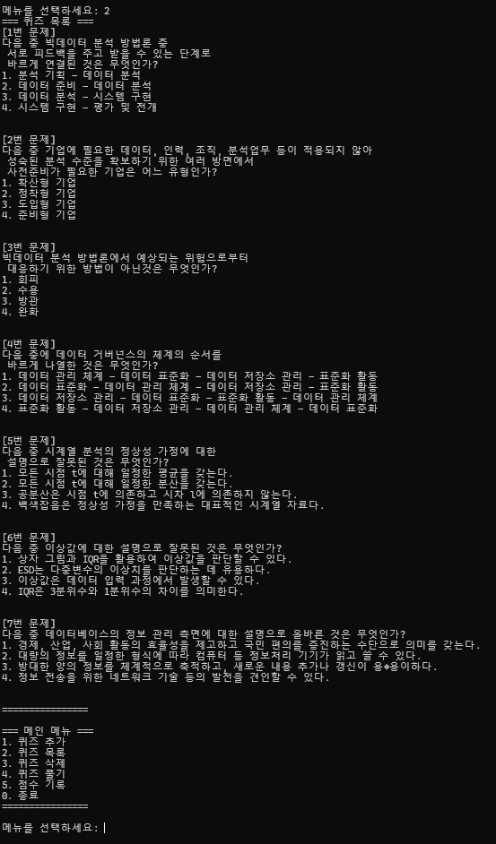

### 퀴즈 삭제

목록에서 삭제할 문제 번호를 선택한 후 `y/n` 확인을 거쳐 삭제한다.

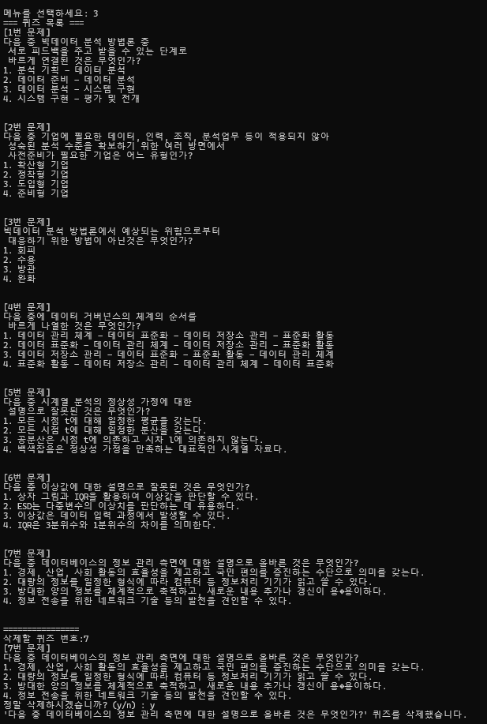

### 문제 수 선택 및 랜덤 출제

현재 등록된 문제 수 범위 안에서 원하는 문제 수를 선택한다.

```python
random.sample(self.quizzes, quiz_count)
```

을 사용하여 중복 없이 랜덤으로 문제를 선택한다.

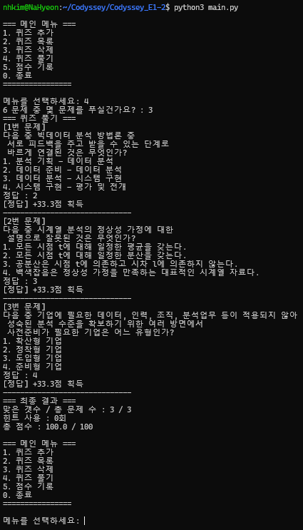

### 힌트

퀴즈에 힌트가 존재하면 사용 여부를 선택할 수 있다.

힌트를 사용한 뒤 정답을 맞히면 해당 문제 배점의 50%만 획득한다.

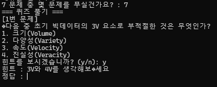

---

## 9. 점수 계산 및 최고 기록

게임 점수는 항상 100점 만점을 기준으로 계산한다.

```text
문제당 배점 = 100 / 선택한 문제 수
```

| 결과 | 획득 점수 |
| --- | --- |
| 힌트 없이 정답 | 문제 배점의 100% |
| 힌트 사용 후 정답 | 문제 배점의 50% |
| 오답 | 0점 |

최종 점수는 소수점 첫째 자리까지 저장한다.

```python
final_score = round(earned_score, 1)
```

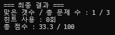

### 최고 점수

게임이 끝날 때 현재 점수와 기존 최고 점수를 비교한다.

```text
이번 점수 > 기존 최고 점수
        ↓
best_score 갱신
best_game 갱신
```

동일한 최고 점수가 다시 나온 경우에는 먼저 최고 점수를 달성한 기록을 유지한다.

`best_score`에는 점수만 저장하고 `best_game`에는 해당 점수를 획득한 게임의 전체 기록을 저장한다.

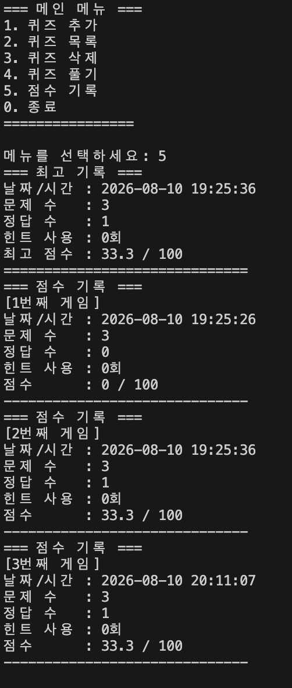

---

## 10. 데이터 저장 구조

게임 데이터는 `state.json`에 저장된다.

현재 데이터 구조는 다음과 같다.

```json
{
  "quizzes": [
    {
      "question": "문제 내용",
      "choices": [
        "선택지 1",
        "선택지 2",
        "선택지 3",
        "선택지 4"
      ],
      "answer": 2,
      "hint": ""
    }
  ],
  "score_history": [
    {
      "played_at": "2026-08-10 19:25:36",
      "question_count": 3,
      "correct_count": 1,
      "hint_count": 0,
      "score": 33.3
    }
  ],
  "best_score": 33.3,
  "best_game": {
    "played_at": "2026-08-10 19:25:36",
    "question_count": 3,
    "correct_count": 1,
    "hint_count": 0,
    "score": 33.3
  }
}
```

각 최상위 필드의 역할은 다음과 같다.

| 필드 | 역할 |
| --- | --- |
| `quizzes` | 저장된 전체 퀴즈 |
| `score_history` | 플레이한 모든 게임 기록 |
| `best_score` | 역대 최고 점수 |
| `best_game` | 최고 점수를 달성한 게임의 상세 기록 |

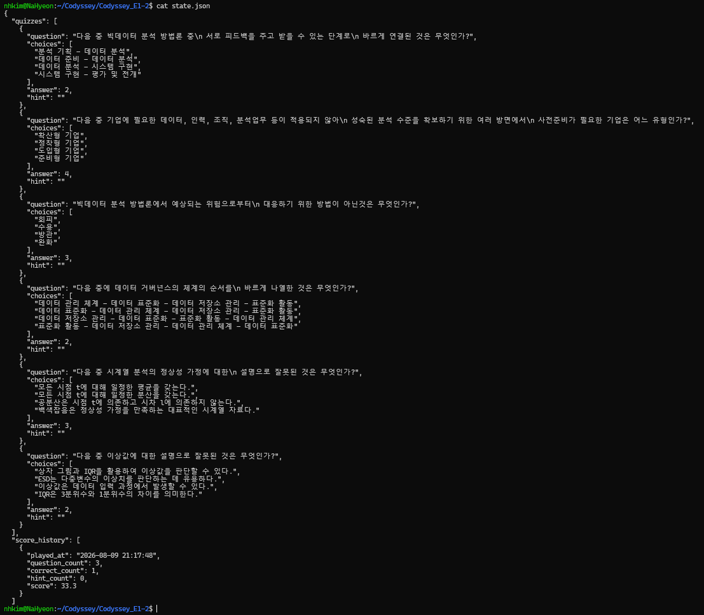

### 이전 JSON과의 호환

이전 버전의 `state.json`에는 `best_score`와 `best_game`이 없을 수 있다.

이 경우 기존 `score_history`에서 가장 높은 점수의 기록을 찾아 최고 기록을 복원한다.

```python
best_game = max(
    score_history,
    key=lambda record: record.get("score", 0),
)
```

따라서 기존 게임 기록을 버리지 않고 새로운 최고 기록 구조로 전환할 수 있다.

---

## 11. 기본 데이터 및 복구 정책

`DataManager.load()`는 저장 파일 상태에 따라 다음과 같이 처리한다.

```text
state.json 없음
    ↓
기본 퀴즈 6개
score_history = []
best_score = 0.0
best_game = None
```

```text
state.json JSON 문법 손상
    ↓
json.JSONDecodeError
    ↓
기본 데이터 복구
```

```text
필수 키 누락
    ↓
KeyError
    ↓
기본 데이터 복구
```

```text
정상 JSON + quizzes=[]
    ↓
사용자가 모든 퀴즈를 삭제한 정상 상태
    ↓
빈 목록 유지
```

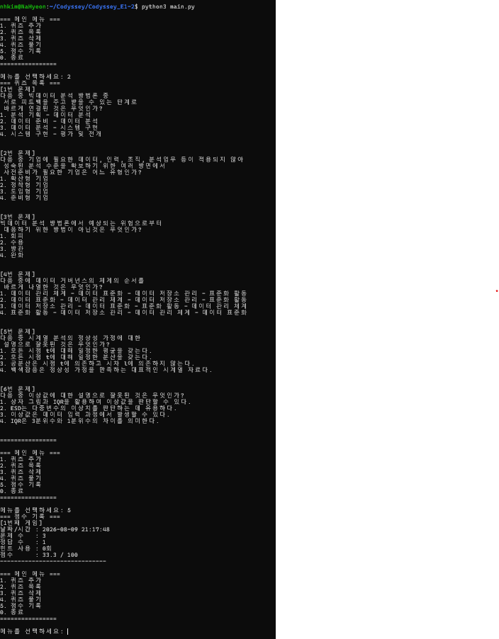

---

## 12. JSON을 선택한 이유

이 프로젝트는 별도의 데이터베이스 대신 JSON을 사용했다.

### 장점

- Python 표준 라이브러리만으로 읽기/쓰기 가능
- 사람이 직접 파일 내용을 확인하기 쉬움
- 객체를 딕셔너리 구조로 단순하게 변환 가능
- 프로젝트 규모가 작을 때 설정이 간단함
- 다른 프로그래밍 언어와 데이터를 교환하기 쉬움

### 단점

- 데이터가 많아지면 파일 전체를 읽고 저장해야 함
- 조건 검색이나 정렬 기능이 데이터베이스보다 부족함
- 여러 프로세스가 동시에 파일을 수정할 경우 충돌 가능
- 데이터 관계가 복잡해질수록 관리하기 어려움

현재 프로젝트 규모에서는 구조가 단순하고 외부 라이브러리가 필요하지 않은 JSON이 적합하다고 판단했다.

---

## 13. 입력 검증 정책

입력 처리는 `ConsoleUI`에서 공통으로 처리한다.

### 숫자 입력

`get_number()`는 다음 순서로 검사한다.

```text
입력
 ↓
빈 값인가?
 ↓
숫자인가?
 ↓
허용 범위인가?
 ↓
정상 값 반환
```

다음과 같은 입력은 다시 입력하도록 처리한다.

```text
빈 문자열
abc
범위보다 작은 숫자
범위보다 큰 숫자
```

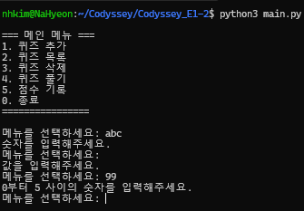

### 재시도 정책

현재 프로그램은 잘못된 입력 횟수에 제한을 두지 않고 정상 입력이 들어올 때까지 재입력을 요청한다.

터미널 기반 학습 프로그램이기 때문에 사용자가 잘못 입력했다는 이유만으로 프로그램을 종료하지 않는 방식을 선택했다.

향후 서비스 형태로 확장한다면 다음 기능을 추가할 수 있다.

- 입력 실패 횟수 `attempt_count` 관리
- 일정 횟수 이상 실패 시 메뉴 복귀
- 잘못된 입력 이벤트 로그 기록

현재 버전에는 재시도 횟수 제한이나 별도의 입력 로그 파일은 구현하지 않았다.

---

## 14. 프로그램 종료 및 시그널 처리

프로그램 종료 관련 처리는 `main.py`에서 담당한다.

### 정상 종료

메뉴에서 `0`을 입력하면 다음 메시지를 출력한다.

```text
게임을 종료합니다.
```

그 후 `finally`에서 데이터를 저장하고 종료 메시지를 출력한다.

```text
게임 데이터를 저장하고 종료합니다. 다음에 또 만나요!
```

따라서 종료 과정 자체가 터미널 로그로 확인 가능하다.

### Ctrl+C

`Ctrl+C`는 Python에서 `KeyboardInterrupt`를 발생시킨다.

```python
except (KeyboardInterrupt, EOFError):
```

에서 예외를 처리한 뒤 `finally`를 실행해 데이터를 저장한다.

### Ctrl+D

WSL/Linux 환경에서 `Ctrl+D`로 입력이 종료되면 `EOFError`가 발생하며 `Ctrl+C`와 동일하게 안전 종료한다.

### Ctrl+Z

Linux 계열 환경에서 `Ctrl+Z`는 일반적으로 프로세스를 종료하는 것이 아니라 `SIGTSTP`를 보내 프로세스를 일시 정지한다.

프로그램이 일시 정지된 상태에서 터미널이 종료되면 메모리의 데이터가 저장되지 않을 수 있기 때문에 다음 처리를 추가했다.

```python
if hasattr(signal, "SIGTSTP"):
    signal.signal(signal.SIGTSTP, signal.SIG_IGN)
```

지원되는 환경에서는 `Ctrl+Z`에 의한 프로그램 정지를 방지한다.

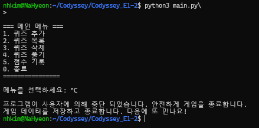

### 종료 로그의 현재 한계

현재는 터미널에 종료 및 저장 관련 메시지를 출력하지만 별도의 로그 파일은 생성하지 않는다.

또한 `DataManager.save()` 내부에서 저장 실패가 발생하면 오류 메시지를 출력하지만, 향후에는 `save()`가 성공 여부를 `bool`로 반환하도록 변경하여 성공/실패 상태를 `main.py`에서 구분해 기록할 수 있다.

---

## 15. 안전한 파일 저장

데이터를 직접 `state.json`에 작성하다가 프로그램이나 디스크 문제가 발생하면 기존 파일까지 손상될 수 있다.

이를 줄이기 위해 다음 순서로 저장한다.

```text
게임 데이터
    ↓
state.json.tmp 생성
    ↓
JSON 저장
    ↓
저장 성공
    ↓
state.json으로 replace
```

코드에서는 다음 방식으로 처리한다.

```python
temp_path.replace(self.file_path)
```

저장 중 `OSError`가 발생하면 오류 메시지를 출력하고 남아 있는 임시 파일을 삭제한다.

```python
if temp_path.exists():
    temp_path.unlink()
```

`.gitignore`에는 `state.json.tmp`를 포함하여 임시 파일이 Git에 올라가지 않도록 했다.

---

## 16. 동시 실행에 대한 한계

현재 프로그램은 **한 사용자가 하나의 프로세스로 실행하는 것을 전제**한다.

두 개 이상의 프로그램이 동시에 같은 `state.json`을 수정할 경우 다음 문제가 발생할 수 있다.

```text
프로세스 A가 데이터 읽기
프로세스 B가 데이터 읽기
프로세스 A가 저장
프로세스 B가 저장
        ↓
마지막 저장 결과가 이전 변경을 덮어쓸 수 있음
```

현재 버전에는 파일 잠금 기능이 구현되어 있지 않다.

다중 프로세스 환경으로 확장할 경우 다음 방법을 고려할 수 있다.

```text
1. 파일 Lock 적용
2. 프로세스별 임시 파일 사용
3. SQLite 등 트랜잭션을 지원하는 DB로 이전
```

WSL/Linux에 한정할 경우 표준 라이브러리의 `fcntl`을 이용한 파일 잠금도 고려할 수 있다.

---

## 17. 백업 및 복구 전략

현재 구현된 데이터 보호 방법은 다음과 같다.

```text
state.json.tmp
    ↓
저장 성공 확인
    ↓
state.json 교체
```

현재 `.bak` 백업 또는 원격 자동 백업 기능은 구현되어 있지 않다.

추후 데이터 중요도가 높아질 경우 다음 구조로 확장할 수 있다.

```text
state.json
    ↓
state.json.bak 백업
    ↓
state.json.tmp 저장
    ↓
state.json 교체
```

예를 들어 프로그램 실행 전 또는 일정 횟수 저장마다:

```text
state.json.bak
```

파일을 생성해 이전 상태를 보관할 수 있다.

더 큰 서비스에서는 GitHub와 같은 소스 저장소가 아니라 별도의 DB 백업이나 원격 스토리지를 이용해 주기적으로 데이터를 보관하는 것이 적합하다.

---

## 18. 실행 방법

프로젝트를 clone하는 경우:

```bash
git clone https://github.com/yhana972/Codyssey_E1-2.git
cd Codyssey_E1-2
```

WSL Ubuntu에서 실행:

```bash
python3 main.py
```

외부 패키지를 사용하지 않으므로 별도의 `pip install` 과정은 필요하지 않다.

---

## 19. 테스트 및 검증

### Python 문법 검사

다음 명령으로 전체 Python 파일의 문법을 검사했다.

```bash
python3 -m py_compile \
  main.py \
  quiz.py \
  quiz_game.py \
  console_ui.py \
  data_manager.py
```

정상인 경우 별도의 출력 없이 종료된다.

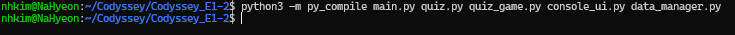

### JSON 구조 검사

```bash
python3 -m json.tool state.json
```

을 사용해 `state.json`의 JSON 문법과 저장 결과를 확인할 수 있다.

### 주요 검증 항목

```text
퀴즈 추가
→ 목록에 표시되는가?

퀴즈 삭제
→ 목록에서 제거되는가?

프로그램 종료
→ state.json에 반영되는가?

프로그램 재실행
→ 이전 데이터가 복원되는가?

잘못된 숫자 입력
→ 프로그램이 종료되지 않고 재입력을 받는가?

JSON 손상
→ 기본 데이터로 복구되는가?

Ctrl+C / Ctrl+D
→ finally를 거쳐 저장 후 종료되는가?

Ctrl+Z
→ 프로그램이 suspend되지 않는가?

새로운 최고점
→ best_score와 best_game이 갱신되는가?
```

---

## 20. Git 원격 저장소

GitHub Repository:

[https://github.com/yhana972/Codyssey_E1-2](https://github.com/yhana972/Codyssey_E1-2)

현재 `origin` 설정:

```text
origin  https://github.com/yhana972/Codyssey_E1-2.git (fetch)
origin  https://github.com/yhana972/Codyssey_E1-2.git (push)
```

확인 명령:

```bash
git remote -v
```

---

## 21. Git 브랜치 전략

이 프로젝트는 복잡한 Git Flow 전체를 적용하기보다 **기능 단위 Feature Branch 방식**으로 진행했다.

```text
main
 ├─ feature/quiz
 ├─ feature/data
 ├─ feature/game
 ├─ refactor
 └─ feature/update-readme
```

작업 흐름은 다음과 같다.

```text
main에서 브랜치 분리
        ↓
기능 구현
        ↓
테스트
        ↓
커밋
        ↓
main 최신 내용 반영
        ↓
merge 또는 Pull Request
        ↓
main 반영
```

README 수정 작업은 실제 Pull Request를 통해 병합한 기록도 있다.

[Pull Request #1](https://github.com/yhana972/Codyssey_E1-2/pull/1)

### 병합 전략

프로젝트에서는 기능별 브랜치에서 작업한 뒤 `main`으로 병합하는 방식을 사용했다.

병합 커밋을 유지함으로써 어느 시점에 기능 브랜치가 `main`으로 합쳐졌는지 Git 그래프에서 확인할 수 있도록 했다.

### 충돌 처리 정책

브랜치 작업 중 `main`이 변경된 경우 다음 순서를 기준으로 처리한다.

```bash
git switch <작업-브랜치>
git pull
git merge main
```

충돌이 발생하면:

```text
1. 충돌 파일 확인
2. 현재 브랜치와 main 변경 내용 비교
3. 필요한 코드만 선택해 충돌 해결
4. 프로그램 실행 및 py_compile 확인
5. 해결된 파일 git add
6. 병합 커밋 생성
```

즉 충돌을 해결한 뒤 바로 병합하지 않고 최소한의 실행 검증을 수행하는 것을 기준으로 한다.

---

## 22. Git 커밋 정책

한 커밋에는 가능한 하나의 의미 있는 작업만 포함하도록 구성했다.

예:

```text
기능 추가
버그 수정
문서 수정
리팩터링
병합
```

프로젝트 Git 이력에서는 다음 형태의 접두사를 사용했다.

| 접두사 | 의미 | 예시 |
| --- | --- | --- |
| `Feat` | 기능 추가 | `Feat : 힌트 사용과 점수 차감 기능 추가` |
| `Fix` | 오류 수정 | `Fix : 전체 실행 테스트에서 발생한 이슈 수정` |
| `Docs` | 문서 수정 | `Docs : README 이미지 추가` |
| `Merge` | 브랜치 병합 | `Merge branch 'feature/update-readme'` |

실제 예:

```text
Feat : 게임 점수 기록 저장 기능 및 점수 기록 조회 기능 추가
Feat : 힌트 사용과 점수 차감 기능 추가
Feat : 퀴즈 문제 수 선택 및 랜덤 출제 추가
Feat : 퀴즈 풀이와 점수 계산 추가
Fix : 전체 실행 테스트에서 발생한 이슈 수정
Fix : Ctrl+Z로 프로그램 중단되지 않도록 처리
Docs : README 이미지 추가
```

---

## 23. Git 주요 명령 실습

프로젝트에서 다음 Git 명령을 실습했다.

```bash
git init
git clone
git add
git commit
git push
git pull
git checkout
git switch
git merge
git log
```

### clone

```bash
git clone https://github.com/yhana972/Codyssey_E1-2.git
```

### pull

```bash
git pull origin main
```

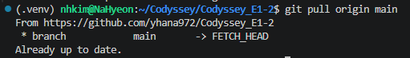

### 최초 커밋

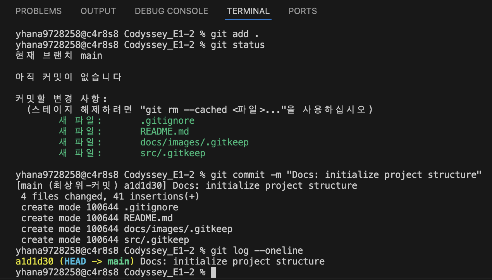

### 최초 Push

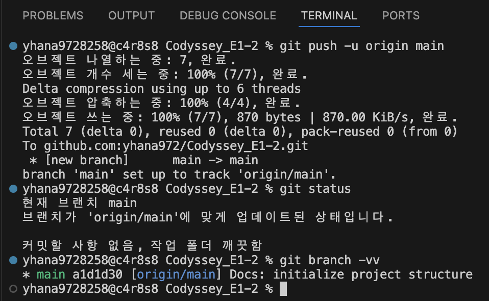

---

## 24. 실제 Git 로그

다음 명령으로 전체 브랜치와 병합 기록을 확인했다.

```bash
git log --oneline --graph --decorate --all -20
```

확인된 로그:

```text
* 131adf0 (HEAD -> main, origin/main, origin/HEAD) Feat : 메인 최종 푸시
* f1a1c43 Merge branch 'feature/update-readme'
|\
| * 01bea47 (origin/feature/update-readme) docs: add README screenshots
| * ace53df Merge branch 'main' into feature/update-readme
| |\
| |/
|/|
* | e87eab7 Merge branch 'main' of https://github.com/yhana972/Codyssey_E1-2
|\ \
| * \ 309706f Merge pull request #1 from yhana972/feature/update-readme
| |\ \
* | | 8a8f02c (origin/feature/game) Fix : 퀴즈 풀기 점수 표시 방법 변경
|/ / /
| | * 5162246 Docs : README 이미지 추가
| | * 8dc0852 docs: mark README image positions
| |/
| * b391d50 docs: update project README
|/
* 306a31b Fix : Ctrl+Z로 프로그램 중단되지 않도록 처리
* 518d55d Fix : 전체 실행 테스트에서 발생한 이슈 수정
* 9ef182c Feat : 게임 점수 기록 저장 기능 및 점수 기록 조회 기능 추가
* 3a4998c Feat : 힌트 사용과 점수 차감 기능 추가
* 7974888 Feat : 퀴즈 문제 수 선택 및 랜덤 출제 추가
* aa32b0e Feat : 퀴즈 풀이와 점수 계산 추가
* 78776bb Feat : 퀴즈 삭제 기능 추가
* e95a3e4 Feat : 퀴즈 목록 보기 추가
* eb9d0ec Feat: 퀴즈 추가 기능 구현
* d8a24d2 Feat: 퀴즈 힌트 데이터 추가
```

Git 로그를 통해 다음 내용을 확인할 수 있다.

- 의미 있는 커밋 10개 이상
- 기능 단위 커밋
- `feature/game` 브랜치 사용
- `feature/update-readme` 브랜치 사용
- 브랜치 병합 커밋
- Pull Request 병합 기록
- 원격 `main`과 로컬 `main` 연결

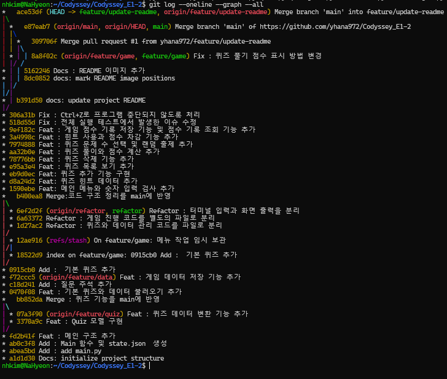

---

## 25. 데이터 구조 확장 방법

현재 퀴즈 구조는 다음과 같다.

```json
{
  "question": "문제",
  "choices": [],
  "answer": 2,
  "hint": ""
}
```

추후 기능이 확장되면 다음과 같은 메타데이터를 추가할 수 있다.

```json
{
  "question": "문제",
  "choices": [],
  "answer": 2,
  "hint": "",
  "metadata": {
    "difficulty": "medium",
    "tags": [
      "ADsP",
      "시계열"
    ],
    "category": "데이터 분석"
  }
}
```

`metadata`와 같이 관련 정보를 하나의 중첩 객체로 묶으면 새로운 필드가 증가하더라도 기존 문제 데이터와 부가 정보를 구분하기 쉽다.

`Quiz.from_dict()`에서 기본값을 이용하면 기존 JSON과의 호환성도 유지할 수 있다.

---

## 26. 대규모 데이터 확장 시 고려사항

현재 구현은 모든 퀴즈와 게임 기록을 한 번에 메모리에 불러온다.

문제가 수십 개 수준일 때는 단순하고 효율적이지만 퀴즈가 1,000개 이상으로 증가하면 다음과 같은 한계가 발생할 수 있다.

### 메모리

```text
state.json 전체 읽기
        ↓
모든 Quiz 객체 생성
        ↓
메모리에 전체 보관
```

데이터가 많아질수록 메모리 사용량이 증가한다.

### 저장 성능

퀴즈 하나만 변경되어도 현재 방식에서는 전체 `state.json`을 다시 저장한다.

```text
1개 퀴즈 변경
    ↓
전체 JSON 직렬화
    ↓
전체 파일 다시 쓰기
```

### 검색

현재는 Python 리스트를 기준으로 데이터를 관리하기 때문에 카테고리, 난이도, 키워드 검색 기능이 증가하면 반복 탐색이 많아질 수 있다.

### 확장 대안

문제 수와 사용자가 많아진다면 다음과 같은 구조가 더 적합하다.

```text
JSON
 ↓
SQLite
 ↓
필요한 데이터만 조회
 ↓
페이지 단위 출력
```

Python 표준 라이브러리에 포함된 `sqlite3`를 사용하면 외부 패키지 없이도 다음 기능을 구현할 수 있다.

- 조건 검색
- 정렬
- 인덱스
- 페이지 단위 조회
- 트랜잭션
- 일부 데이터만 수정

따라서 현재 JSON 방식은 소규모 학습 프로젝트에 적합하고, 데이터가 크게 증가하는 경우 SQLite 또는 별도의 데이터베이스로 이전하는 것이 적합하다.

---

## 27. 요구사항 변경 시 수정 위치

역할별로 코드를 분리했기 때문에 요구사항이 변경되었을 때 수정 위치를 비교적 쉽게 찾을 수 있다.

| 변경 요구사항 | 수정할 주요 위치 |
| --- | --- |
| 문제 데이터 필드 추가 | `Quiz.__init__()`, `to_dict()`, `from_dict()` |
| 정답 판정 규칙 변경 | `Quiz.is_correct()` |
| 메뉴 추가 | `ConsoleUI.show_main_menu()`, `QuizGame.run()` |
| 사용자 입력 규칙 변경 | `ConsoleUI.get_number()`, `get_text()`, `get_yes_no()` |
| 문제 출력 형태 변경 | `ConsoleUI.show_quiz()` |
| 점수 계산 방법 변경 | `QuizGame.play_quiz()` |
| 힌트 감점 비율 변경 | `QuizGame.play_quiz()` |
| 최고 기록 정책 변경 | `QuizGame.play_quiz()` |
| 점수 기록 출력 변경 | `ConsoleUI.show_score_record()`, `show_best_record()` |
| JSON 저장 필드 변경 | `DataManager.load()`, `save()` |
| 파일 복구 정책 변경 | `DataManager.load()` |
| 종료 처리 변경 | `main.py` |

예를 들어 문제당 점수 계산 방식을 변경하고 싶다면 JSON이나 UI 코드를 수정할 필요 없이 `QuizGame.play_quiz()`의 점수 계산 부분을 중심으로 확인할 수 있다.

이처럼 클래스별 책임을 분리하여 요구사항 변경에 따른 영향 범위를 줄이는 것을 목표로 했다.

---

## 28. 현재 구현과 향후 개선 사항

현재 프로젝트에서 구현한 범위와 아직 구현하지 않은 확장 기능을 구분하면 다음과 같다.

### 현재 구현

```text
퀴즈 CRUD
랜덤 문제 출제
문제 수 선택
힌트
점수 계산
전체 기록
최고 기록
JSON 영속성
JSON 손상 복구
임시 파일 안전 저장
입력 검증
Ctrl+C / Ctrl+D / Ctrl+Z 처리
Git 브랜치 개발 및 병합
```

### 향후 개선 가능 기능

```text
입력 실패 횟수 제한
별도 로그 파일
저장 성공/실패 상태 반환
파일 잠금
.bak 자동 백업
검색 및 필터
난이도/태그
페이지 단위 문제 조회
SQLite 이전
원격 데이터 백업
```

향후 개선 항목은 설계 방향만 정리한 것이며 현재 프로그램에 구현된 기능과 구분한다.

---

## 29. 실행 결과

### 개발 환경


### 메인 메뉴


### 입력 검증


### 퀴즈 추가


### 퀴즈 목록


### 퀴즈 삭제


### 랜덤 문제 출제


### 힌트


### 최종 점수


### 점수 기록

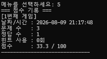

### 최고 점수


### JSON 데이터


### 데이터 복구


### 안전 종료


### Python 문법 검사


### Git 로그


---

## 30. 프로젝트를 통해 학습한 내용

이 프로젝트를 통해 하나의 Python 콘솔 프로그램을 기능별 클래스로 분리하는 과정을 실습했다.

`Quiz`는 한 문제의 데이터와 정답 판정을 담당하고, `QuizGame`은 전체 게임 흐름과 점수 계산을 담당하도록 분리했다.

`ConsoleUI`는 사용자 입력과 화면 출력을 담당하며 `DataManager`는 JSON 파일 저장과 복원을 담당한다.

이를 통해 게임 로직, 사용자 입출력, 데이터 저장 코드가 하나의 파일에 섞이지 않도록 구성했다.

또한 다음 내용을 직접 구현하고 검증했다.

- JSON 직렬화와 역직렬화
- 객체와 딕셔너리 변환
- 예외 처리
- 사용자 입력 검증
- 파일 손상 복구
- 임시 파일을 통한 안전 저장
- 데이터 영속성
- 최고 기록 관리
- 랜덤 문제 출제
- Git 브랜치 생성과 병합
- Pull Request
- Git 커밋 단위 관리
- 프로그램 종료 시그널 처리

작은 프로젝트이지만 요구사항이 추가될 때 어느 파일과 메서드를 수정해야 하는지 추적할 수 있도록 역할을 분리하는 것을 주요 목표로 했다.
